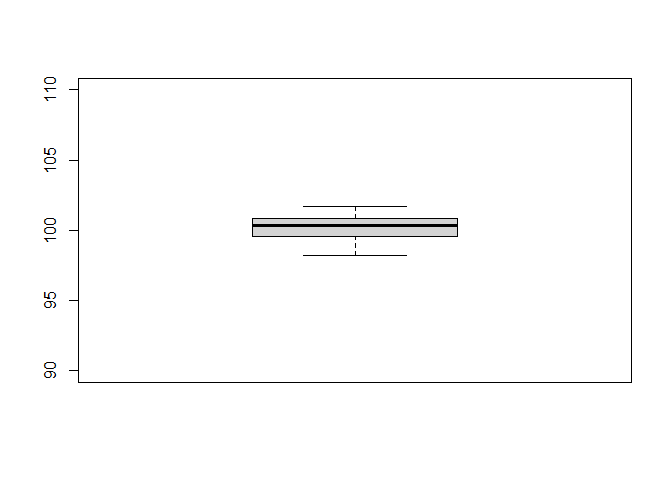
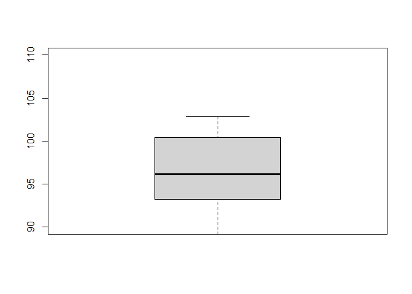
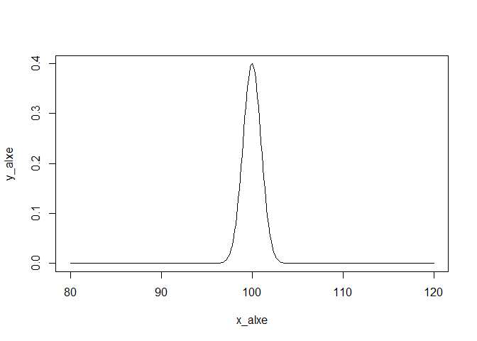
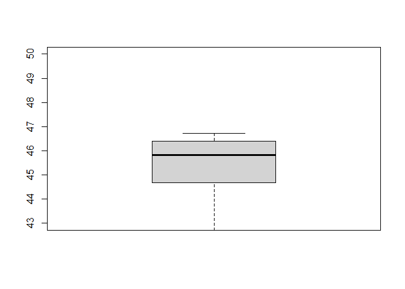
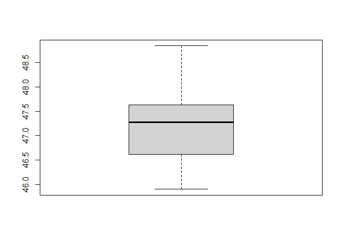

## sampling from normal distribution

    help(rnorm)

    ## starting httpd help server ... done

    # rnorm generate random deviates from a normal dis
    q1_1=rnorm(10,mean=100,sd=1)
    q1_2=rnorm(10,mean=100,sd=10)
    summary(q1_1)

    ##    Min. 1st Qu.  Median    Mean 3rd Qu.    Max. 
    ##   98.21   99.72  100.33  100.26  100.79  101.70

    summary(q1_2)

    ##    Min. 1st Qu.  Median    Mean 3rd Qu.    Max. 
    ##   84.61   93.70   96.18   97.05   99.66  114.82

    # plot the x and y
    boxplot(q1_1,ylim=c(90,110))

    boxplot(q1_2,ylim=c(90,110))

    # q1_1 was drawn from the dis as following:
    x_alxe=seq(80, 120, by = .1)
    y_alxe=dnorm(x_alxe, mean = 100, sd = 1)
    plot(x_alxe,y_alxe,type="l")

## t-tests

# one sample t-test

    q2_df=rnorm(10,mean=45,sd=1)
    q2_df

    ##  [1] 46.08124 45.02077 44.74277 44.83699 43.95855 45.56416 44.89990 43.59752
    ##  [9] 45.90411 43.90037

    # compare with mu by code
    t.test(q2_df, mu = 50)

    ## 
    ##  One Sample t-test
    ## 
    ## data:  q2_df
    ## t = -19.242, df = 9, p-value = 1.277e-08
    ## alternative hypothesis: true mean is not equal to 50
    ## 95 percent confidence interval:
    ##  44.24525 45.45603
    ## sample estimates:
    ## mean of x 
    ##  44.85064

    #df =n-1= 9

    # compare with mu by hand
    q2_mean=mean(q2_df)
    q2_se=sd(q2_df)/sqrt(10)
    p5_2tail=qt(c(.025, .975), df=9)
    CI95_lower=q2_mean+p5_2tail[1]*q2_se
    CI95_upper=q2_mean+p5_2tail[2]*q2_se
    CI95_lower

    ## [1] 44.24525

    CI95_upper

    ## [1] 45.45603

# two samples independent t-test

    q2_df=rnorm(10,mean=45,sd=1)
    q3_df=rnorm(10,mean=47,sd=1)
    boxplot(q2_df,ylim=c(43,50))

    boxplot(q3_df)

    t.test(q2_df,q3_df,var.equal = TRUE)

    ## 
    ##  Two Sample t-test
    ## 
    ## data:  q2_df and q3_df
    ## t = -3.2892, df = 18, p-value = 0.004077
    ## alternative hypothesis: true difference in means is not equal to 0
    ## 95 percent confidence interval:
    ##  -2.9884936 -0.6588207
    ## sample estimates:
    ## mean of x mean of y 
    ##  45.38775  47.21140

    #df =N-2=2n-2=18

# two samples dependent t-test

    t.test(q2_df,q3_df, paired = T)

    ## 
    ##  Paired t-test
    ## 
    ## data:  q2_df and q3_df
    ## t = -3.2127, df = 9, p-value = 0.01061
    ## alternative hypothesis: true difference in means is not equal to 0
    ## 95 percent confidence interval:
    ##  -3.1077405 -0.5395738
    ## sample estimates:
    ## mean of the differences 
    ##               -1.823657

    # t = -2.3333, df =n-1=9, p-value = 0.0445
